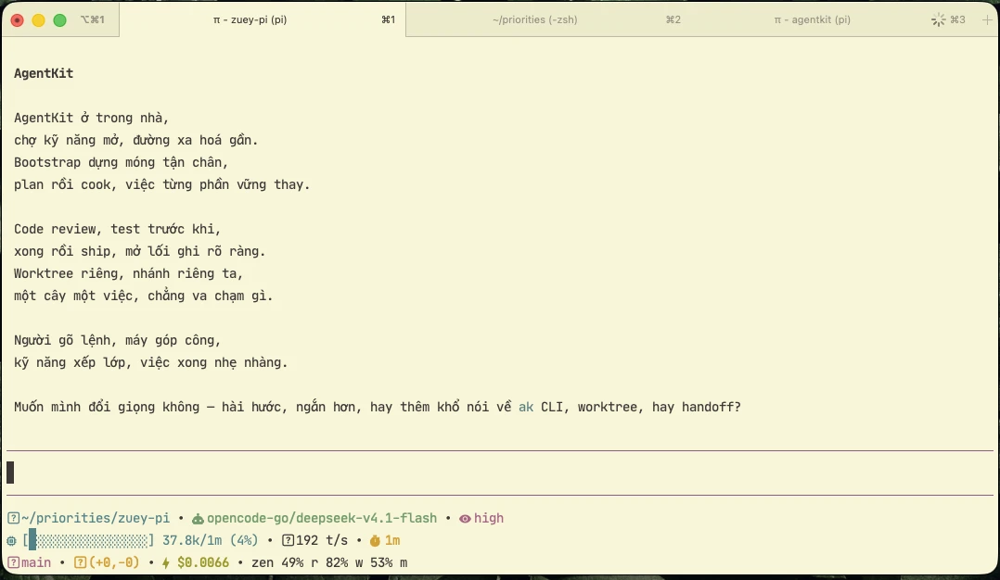
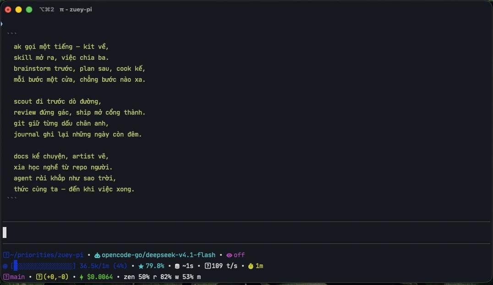

<div align="center">

# zuey-pi-setup

**Portable snapshot của setup [`pi`](https://github.com/earendil-works/pi) — clone về là dựng lại nguyên bộ 19 extensions trên máy mới.**

pi `0.85.1` · Node `24` · macOS/Linux · cập nhật 2026-09-15

</div>

---

## Vì sao có repo này

`pi` không có tính năng export/import config. Repo này là cách mang **toàn bộ setup** sang máy khác một cách xác định (deterministic) và không cần copy cache:

- `~/.pi/agent/npm/` (~250 MB) — **không cần**, pi tự cài lại từ `settings.json`
- `~/.pi/agent/auth.json` — **không đưa vào repo** (chứa API key + OAuth token), login lại ở máy mới
- `~/.pi/agent/sessions/` (~56 MB) và `missions/` — **không đưa vào repo** (history/state, và có thể chứa dữ liệu nội bộ)

Cơ chế: `settings.json` chứa mảng `packages`; pi đọc nó lúc khởi động và `npm install` mọi package còn thiếu. Nên mang được manifest = mang được cả bộ extension.

---

## Quickstart (máy mới)

```bash
# 1) cài pi, đúng version
npm i -g @earendil-works/pi-coding-agent@0.85.1

# 2) clone
git clone https://github.com/mrgoonie/zuey-pi-setup.git
cd zuey-pi-setup

# 3) thử an toàn vào thư mục tạm (không đụng config thật)
./scripts/pi-setup-restore.sh --from-config config --scratch --install --verify

# 4) làm thật
./scripts/pi-setup-restore.sh --install --verify
```

Sau đó login lại provider (auth không nằm trong repo):

```bash
pi auth check --provider opencode-go    # và /login trong pi cho từng provider
```

Chi tiết đầy đủ, bảng copy/không-copy, xử lý sự cố: **[`docs/pi-setup-migration.md`](./docs/pi-setup-migration.md)**.

---

## Screenshots

Statusline được xếp đúng 3 hàng — context bar theo context window của model, tốc độ token, git, chi phí, và status của các extension khác được đưa vào cùng hàng:

**Theme sáng** (thinking `high`) — lúc này `cache-hit-rate` và `cache_ttl` bằng 0 nên tự ẩn:



**Theme tối** (thinking `off`) — đủ 5 widget hàng 2, gồm `cache-hit-rate` 79.8% và `cache_ttl` ~1s:



<sub>Ảnh crop từ CleanShot rồi nén **WebP q90**: 1078×626 / 40 KB và 1076×624 / 38 KB — giảm **94%** so với PNG gốc (696 KB). Bản gốc chưa xử lý để ở `screenshots/originals/` (đã gitignore).</sub>

---

## Repo có gì

```
zuey-pi-setup/
├── README.md                        ← bạn đang đọc
├── docs/
│   └── pi-setup-migration.md        hướng dẫn chi tiết + số liệu kiểm chứng
├── fonts/                           JetBrains Mono 1.0.2 (font terminal, OFL-1.1)
│   ├── README.md                    nguồn gốc, cách cài, cảnh báo Nerd Font
│   ├── LICENSE.txt                  SIL Open Font License 1.1
│   └── JetBrainsMono-1.0.2/         ttf/ (1 MB, dùng cho terminal) + web/ (2 MB, cho web)
├── screenshots/                     ảnh statusline dùng trong README (WebP, ~40 KB/ảnh)
│   └── originals/                   bản gốc CleanShot chưa xử lý (gitignore)
├── scripts/
│   ├── pi-setup-backup.sh           đóng gói setup hiện tại của máy đang chạy
│   └── pi-setup-restore.sh          dựng lại setup trên máy mới
├── backups/
│   └── pi-setup-portable.tar.gz     bundle sẵn để tải (đã lọc — xem bên dưới)
└── config/                          snapshot setup (plain file, diff được bằng git)
    ├── .pi-setup-exclude           glob loại trừ — backup tôn trọng file này
    ├── settings.json               manifest 19 packages + model/theme/compaction
    ├── advisor.json                config pi-advisor-flow (ở gốc config dir)
    ├── APPEND_SYSTEM.md            system prompt phụ
    ├── models-store.json           catalog model (khỏi chờ refresh 4h)
    └── extensions/                 extension tự viết, không có trên npm
        ├── pi-footer-cache-tps.ts  đẩy cache-TTL + tốc độ token (t/s) vào pi-footer
        ├── pi-footer.json          layout statusline (gồm context bar)
        └── provider-fallback.json  fallback model của pi-provider-fallback
```

`config/` là **mirror** của phần setup trong `~/.pi/agent`. Mọi thứ khác (cache, secret, history) **không** được đưa vào.

### Không nằm trong repo (do công cụ khác sinh, tự cài lại được)

| Bị loại | Do ai sinh | Vì sao loại |
|---|---|---|
| `extensions/orca-*.ts` (3 file, 1 239 dòng) | Orca (`@orca-managed-pi-extension`) | glue code tích hợp Orca; Orca tự sinh lại khi quản lý pi |
| `extensions/agentkit-agent/`, `extensions/agentkit-hooks-engineer/` | AgentKit (`ak`) | 1.2 MB hook đã sinh + cache chứa **path tuyệt đối** (`native-skill-paths.json` 157 KB); `ak` tự cài lại |
| `missions/`, `memory/`, `skills/` | pi / AgentKit | state theo máy, không phải setup |

### `.pi-setup-exclude`

`scripts/pi-setup-backup.sh --config-dir config` đọc file này (mỗi dòng 1 glob, `#` = comment) và xoá mọi file khớp sau khi mirror. Nhờ vậy chạy backup lại cũng không tự thêm `orca-*`/`agentkit-*` trở lại repo:

```bash
./scripts/pi-setup-backup.sh --config-dir config   # → "loại trừ: 82 file khớp .pi-setup-exclude"
```

Từ bản hiện tại, cùng file đó cũng dùng được cho **chế độ tarball** qua `--exclude-file`:

```bash
./scripts/pi-setup-backup.sh -o backups/pi-setup-portable.tar.gz \
  --exclude-file config/.pi-setup-exclude
```

### `backups/pi-setup-portable.tar.gz`

Bundle sẵn để tải, khỏi phải clone rồi tự tạo: **7 file** — `settings.json` (19 package), `APPEND_SYSTEM.md`, `models-store.json`, `advisor.json`, `extensions/pi-footer.json`, `extensions/pi-footer-cache-tps.ts` và `extensions/provider-fallback.json`.

Đây là bundle đầy đủ theo mặc định của script, **đã lọc** qua `.pi-setup-exclude` để không mang lên repo public những thứ chỉ thuộc về máy:

| Bị loại | Vì sao |
|---|---|
| `extensions/orca-*.ts` (3 file, 1 239 dòng) | code do Orca sinh — bạn đã chọn không đưa lên public |
| `extensions/agentkit-*` (95 file) | chứa `native-skill-paths.json` + `native-skill-hashes.json` (**path tuyệt đối**, danh sách 107 skill) và `hooks/.logs/hook-log.jsonl` (log hoạt động) |

Restore bundle này cho kết quả **giống hệt** `config/` (19 extension + statusline). Muốn bundle không lọc (giữ cả state của máy) thì bỏ `--exclude-file`.

---

## 19 extensions trong snapshot

| # | Package | Version | Làm gì |
|---|---|---|---|
| 1 | `pi-web-access` | 0.29.0 | web search, fetch URL, clone GitHub repo, đọc PDF, hiểu YouTube + video local |
| 2 | `pi-mcp-adapter` | 2.34.0 | adapter MCP (Model Context Protocol) |
| 3 | `pi-subagents` | 0.68.0 | delegate cho subagent + workflow multi-agent bằng script |
| 4 | `pi-goal-x` | 0.31.4 | `/goal`: lập kế hoạch mục tiêu, tiến độ bền, auditor kiểm tra hoàn thành |
| 5 | `pi-background-tasks` | 2.5.0 | task shell chạy nền, delegated agent read-only, attested run, Fusion workflow |
| 6 | `pi-provider-fallback` | 1.0.4 | fallback model **xuyên provider** khi gặp lỗi tạm thời/quota/model-unavailable; TUI config |
| 7 | `@narumitw/pi-usage` | 0.60.8 | hiển thị usage của account + số dư DeepSeek API |
| 8 | `pi-simplify` | 0.2.3 | review code vừa đổi theo hướng rõ ràng / nhất quán / dễ bảo trì |
| 9 | `pi-footer` | 0.5.1 | statusline nhiều dòng, tuỳ biến được (dùng trong repo này) |
| 10 | `pi-powerline-footer` | 0.17.1 | status bar kiểu powerline (đang **tắt** bằng `"extensions": []`) |
| 11 | `pi-memory` | 0.4.2 | memory + semantic search (qmd) trên daily log / long-term / scratchpad |
| 12 | `pi-worktree` | 1.3.3 | quản lý git worktree, tạo workspace cách ly bằng 1 lệnh |
| 13 | `@juicesharp/rpiv-todo` | 2.10.1 | todo list cho model, render overlay, sống qua `/reload` + compaction |
| 14 | `@juicesharp/rpiv-ask-user-question` | 2.10.1 | hỏi bạn bằng questionnaire có lựa chọn thay vì đoán |
| 15 | `@juicesharp/rpiv-btw` | 2.10.1 | `/btw`: hỏi nhanh 1 câu bằng chính model chính, không làm bẩn conversation |
| 16 | `pi-chime` | 1.2.1 | chuông terminal khi agent trả lời xong |
| 17 | `pi-smart-fetch` | 0.3.17 **(pinned)** | `web_fetch` giả TLS desktop browser + trích nội dung bằng defuddle |
| 18 | `pi-advisor-flow` | 0.6.0 | flow Executor/Advisor: ý kiến thứ hai từ model mạnh hơn, có cổng review trước plan / sau lỗi lặp / trước khi kết thúc |
| 19 | `@tmustier/pi-session-recap` | 0.5.0 | recap “while you were away”: soạn sẵn bản tóm tắt khi bạn rời session, hiện ở cuối transcript / trên editor lúc quay lại. Cho workflow nhiều agent chạy song song |

> Version là **tham khảo tại thời điểm snapshot**; nguồn sự thật là `config/settings.json`. Chỉ `pi-smart-fetch` được pin cứng, phần còn lại floating → máy mới sẽ lấy bản mới nhất. Muốn khớp chính xác, pin lại trong `config/settings.json`.

Provider mặc định: `opencode-go/deepseek-v4.1-flash` (thinking `high`). Model đang bật: xem `enabledModels` trong `config/settings.json`.

---

## Statusline: context bar (0–100%)

Statusline là `pi-footer`, cấu hình ở `config/extensions/pi-footer.json`. Repo này bật sẵn widget **`context-bar`** — thanh tiến độ context theo **context window của từng model** (không phải số cố định):

```json
{
  "type": "context-bar",
  "options": {
    "contextBarMode": "medium",
    "contextConditionalColors": true,
    "hideWhenZero": true
  }
}
```

Kết quả render thật (gọi trực tiếp `render()` của widget, context window 200k):

```
   0%  [░░░░░░░░░░░░░░░░] 0/200k (0%)        fg=blue
  25%  [████░░░░░░░░░░░░] 50k/200k (25%)      fg=blue
  71%  [███████████░░░░░] 142k/200k (71%)     fg=yellow   ← ≥ 70%
  92%  [███████████████░] 184k/200k (92%)     fg=red      ← ≥ 90%
```

Model khác thì thang chia khác — context 1M ở 25% ra `[████░░░░░░░░░░░░] 250k/1m (25%)`. Khi chưa biết context length thì hiện `?`.

| Muốn đổi | Sửa gì trong `pi-footer.json` |
|---|---|
| Độ rộng / kiểu bar | `contextBarMode`: `default` (32 ô, có ngoặc) · `medium` (16 ô, đang dùng) · `short` (10 ô) · `short-only` (10 ô, không hiện số) |
| Bật/tắt đổi màu theo % | `contextConditionalColors` (ngưỡng `contextWarningPercent` 70, `contextDangerPercent` 90) |
| Hiện token thô thay vì bar | đổi `"type": "context-bar"` → `"context-length"`, hoặc dùng `"context-remaining"` / `"context-window"` |

Dòng 2 của statusline hiện tại: `context-bar` → `cache-hit-rate` → 2 event widget (`cache_ttl`, `tps` do `pi-footer-cache-tps.ts` đẩy vào).

### Layout 3 hàng

Statusline được xếp **đúng 3 hàng**, không bỏ widget nào:

| Hàng | Nội dung | Width |
|---|---|---|
| 1 | `cwd` · `model-provider` · `thinking-level` | 71 |
| 2 | `context-bar` · `cache-hit-rate` · `cache_ttl` · `tps` · `total-time` | 80 |
| 3 | `git-branch` · `git-diff` · `cost` · `mcp` · `background-tasks` · `goal` · `usage` | 84 |

**Vì sao trước đây là 4 hàng:** pi-footer render số hàng trong `lines` **cộng thêm 1 hàng** (`extensionStatusRow`) chứa status do các extension khác công bố qua `ctx.ui.setStatus` (`mcp`, `goal`, `background-tasks`, `usage`). Ẩn hàng đó bằng `extensionStatusRow.hiddenKeys` và đưa chúng vào hàng 3 dưới dạng widget `external-status`.

> ⚠️ `hiddenKeys` là danh sách key **chính xác**, không có wildcard. Nếu sau này một extension khác công bố status mới, hàng thứ 4 sẽ quay lại — thêm key đó vào `hiddenKeys` (hoặc dùng `/footer`). Các key đang được phủ (12): `advisor-scout`, `advisor-usage`, `background-tasks`, `goal`, `mcp`, `mcp-auth`, `session-recap`, `stash`, `subagent-slash`, `subagent-slash-text`, `usage`, `worktree`.

**Giới hạn độ rộng:** tổng nội dung là **243 ký tự** (201 của widget + 42 của separator) → 3 hàng thì hàng dài nhất **buộc phải ≥ 81**. Layout hiện tại cần terminal **≥ 85 cột**, hẹp hơn sẽ bị cắt đuôi bằng `…`. Muốn vừa terminal 80 cột, giảm độ rộng: `cwd` → `segments: 2` (−8) và `model-provider` → `model` (−11) ⇒ hàng dài nhất còn ~65.

> Config dùng `"iconMode": "nerd"` nên terminal cần **Nerd Font** (bản patch) mới hiện đủ icon. Trong `fonts/` có JetBrains Mono **gốc** (không patch) — xem [`fonts/README.md`](./fonts/README.md) để biết cách cài bản Nerd Font hoặc đổi sang `emoji`/`text`.

Ảnh thật của layout này: xem [Screenshots](#screenshots).

---

## pi-provider-fallback

Extension fallback model: khi model đang dùng gặp lỗi **transient / quota / model-unavailable**, nó tự chuyển sang model fallback kế tiếp (ưu tiên **cùng provider** trước, rồi provider khác) và **chạy lại prompt bị lỗi**. Nếu model mới có context window nhỏ hơn, nó kích hoạt compaction trước. Swap giữ nguyên cho cả session, model gốc được phục hồi khi shutdown hoặc `/reload`.

```bash
/fallback-config     # TUI để chọn fallback model cho từng provider
/fallback-status     # xem config hiện tại
```

Config lưu ở `~/.pi/agent/extensions/provider-fallback.json` → **nằm trong `extensions/` nên được backup mặc định** (script báo cáo tường minh trong phần *config extension*). Bản mẫu shape: `provider-fallback.example.json` trong package.

> File này chỉ được tạo sau khi bạn chạy `/fallback-config` lần đầu. Nếu bạn đặt biến `PI_PROVIDER_FALLBACK_CONFIG` trỏ ra ngoài config dir, script sẽ cảnh báo là backup không tự thấy được.

---

## `pi-advisor-flow`

Flow **Executor / Advisor**: model đang chạy việc (Executor) có thể xin ý kiến thứ hai từ một model mạnh hơn (Advisor). Có các **cổng review tự động** — trước khi lập plan, sau khi lỗi lặp lại nhiều lần, và trước khi tuyên bố hoàn thành — và có thể dừng hành động theo policy bạn cấu hình. Tham khảo paper *Steering Black-Box LLMs with Advisor Models*.

```bash
/advisor            # xin ý kiến Advisor (mở model picker nếu chưa cấu hình)
/advisor-models     # chọn model Executor + Advisor
/advisor-settings   # cấu hình behavior, context, privacy, limits
```

Config toàn cục ở **`~/.pi/agent/advisor.json`** — nằm ở **gốc** config dir, **không** trong `extensions/`, nên backup phải liệt kê riêng (đã làm). Project có thể override bằng `<project>/.pi/advisor.json`.

Extension này còn công bố 2 status key (`advisor-scout`, `advisor-usage`) — đã được đưa vào `hiddenKeys` + widget inline như 9 key kia, để hàng status không quay lại khi Advisor đang chạy.

State riêng của nó (`advisor-outcomes.jsonl`, `advisor-outcomes-salt`) là log/salt theo máy → đã cho vào `.pi-setup-exclude`, không lên repo.

---

## `@tmustier/pi-session-recap`

Recap **“while you were away”** (theo mẫu away-summary của Claude Code): khi bạn thật sự rời session một lúc, extension soạn sẵn một bản tóm tắt ngắn — việc lớn đang làm trước, rồi bước tiếp theo cụ thể — và đặt ở cuối transcript (TUI thường thì nằm trên editor) để bạn đọc ngay khi quay lại. Làm cho workflow nhiều agent chạy song song ở nhiều tab.

**Không có file config hay state nào** — extension thuần stateless, không đọc/ghi gì trong `~/.pi/agent/`, nên không cần thêm gì vào danh sách backup.

Nó vẫn công bố 1 status key (`session-recap`, hiện `✦ drafting recap…` lúc đang soạn) → đã vào `hiddenKeys` + có widget inline, để statusline không nhảy lên hàng 4 trong lúc recap đang soạn.

> Nếu dùng tmux, cần `set -g focus-events on` trong `~/.tmux.conf` rồi `tmux source-file ~/.tmux.conf` để extension biết bạn đã quay lại.

---

## Scripts

Không script nào hỏi xác nhận — chạy được trong script/CI. Rủi ro xử lý bằng snapshot + cảnh báo ra `stderr`.

### `pi-setup-backup.sh`

Mặc định chỉ lấy **setup**: `settings.json`, `APPEND_SYSTEM.md`, `models-store.json`, `extensions/` — và **luôn lấy cả statusline** (`extensions/pi-footer.json` nằm trong `extensions/`).

```bash
./scripts/pi-setup-backup.sh                       # → ./pi-setup-portable.tar.gz (chỉ setup)
./scripts/pi-setup-backup.sh --config-dir config    # → cập nhật config/ trong repo này
./scripts/pi-setup-backup.sh --skills --hooks       # thêm skills + hooks
./scripts/pi-setup-backup.sh -o ~/Desktop/pi.tar.gz
./scripts/pi-setup-backup.sh --dry-run
```

| Opt-in (mặc định **không** lấy) | Lấy gì | Ghi chú |
|---|---|---|
| `--auth` | `auth.json` | ⚠ **chứa credential** → không đưa lên nơi công khai |
| `--skills` | `skills/` | **dereference symlink** → backup tự chứa (~24 MB, 108 skill) |
| `--hooks` | thư mục `hooks/` trong `~/.pi/agent` | hiện tại: 544 KB. **Không** đụng `~/.claude/hooks` (ở đó có `.env`). Ghi đè `.pi-setup-exclude` cho đường dẫn hooks |
| `--memory` | `memory/` | |
| `--missions` | `missions/` | ⚠ state pi-goal-x, có thể chứa tên project/khách hàng |
| `--sessions` | `sessions/` | lịch sử chat (~56 MB) |
| `--with-state` | `--skills --memory --missions` | |

| Opt-out | Tác dụng |
|---|---|
| `--no-statusline` | **Không** backup cấu hình statusline (`pi-footer.json`, `powerline-footer/theme.json`) — máy mới sẽ dùng layout mặc định |

Script tự: ghi file tạm rồi `mv` (không để lại artifact hỏng khi bị ngắt) · **quét secret** (`sk-*`, `ghp_*`, `xox*`, `BEGIN PRIVATE KEY` có thân base64, `api_key=…`) · **cảnh báo symlink trỏ ra ngoài** · **báo cáo config extension** (statusline / provider-fallback có được backup hay không) · nén deterministic (`gzip -n` → cùng nội dung cho cùng SHA-256) · từ chối ghi `--config-dir` vào `$HOME`, `/`, hoặc chính config dir của pi.

> Về quét secret: script bỏ qua placeholder phổ biến (giá trị thuần chữ như `currentPassword`, dạng `{CLIENT_SECRET}`, PEM header không có thân, entropy thấp như `ghp_aaaa…`). Vẫn có thể báo **fixture trong test của chính package** (VD một chuỗi kiểu Slack token trong test của chính AgentKit) và **chuỗi test bạn từng dán vào chat** (khi dùng `--sessions`, vì transcript nằm trong `sessions/`) — đọc tên file trước khi kết luận.

### `pi-setup-restore.sh`

| Tùy chọn | Tác dụng |
|---|---|
| `--from-config DIR` | restore từ `config/` (plain file) |
| `--bundle FILE` | restore từ `.tar.gz` |
| `--target DIR` | đích khác `~/.pi/agent` |
| `--scratch` | đích là thư mục tạm — **an toàn để thử** |
| `--install` | chạy pi headless 1 lần để tự cài extension (~150–190 s) |
| `--verify` | so số extension đã cài với `settings.json` |
| `--with-trust` | copy cả `trust.json` |
| `--dry-run` | chỉ in ra, không ghi |

Trước khi ghi đè, `settings.json` **và** `auth.json` (nếu nguồn có) được snapshot thành `*.bak.<timestamp>`. Script có `trap ERR` nên không bao giờ thoát im lặng — luôn in số dòng khi gặp lỗi ngoài dự kiến.

---

## Kiểm chứng

Test bằng cách restore vào một config dir **hoàn toàn mới** qua `PI_CODING_AGENT_DIR`, không đụng setup thật.

| Kiểm tra | Kết quả |
|---|---|
| Thời gian cài lần đầu | **136–210 s** qua 6 lần chạy (tuỳ tốc độ npm) |
| Module dirs trong `npm/node_modules` | **0 → 185** (snapshot 19 package) |
| `--verify` | **19/19** ở lần chạy gần nhất, và **18/18 · 17/17 · 16/16** ở các snapshot trước |
| Extension **thực sự chạy** (không chỉ cài) | ✅ 17 `extension_ui_request`, 0 lỗi, đủ surface `subagent-async`, `mcp`, `goal`, `background-tasks`, `usage`, `pi-footer`, `advisor-scout`, `advisor-usage` |
| Clone repo public rồi restore | ✅ 11 file, 0 file bị loại, 153 s, verify khớp, 0 lỗi |
| `auth.json` trong dir mới | `{}` → không rò secret |
| Chạy lần 2 | log rỗng → idempotent |
| Backup 2 lần liên tiếp | **byte-identical** (deterministic) |
| `context-bar` render | ✅ gọi trực tiếp `render()`: 0/25/**71%→vàng**/**92%→đỏ**/100%, scale đúng theo 200k và 1m |
| `--no-statusline` | ✅ `pi-footer.json` biến mất khỏi bundle (SHA khác bản mặc định) |
| `--hooks` + `.pi-setup-exclude` | ✅ hooks sống sót, in cảnh báo "ghi đè", 54 file còn lại |
| `--auth` khi restore | ✅ có `auth.json.bak.<ts>` giữ credential cũ trước khi ghi đè |

---

## Giới hạn đã biết

- **`auth.json` không nằm trong repo** (secret) → `/login` lại ở máy mới.
- **`sessions/` và `missions/` không nằm trong repo** → không migrate lịch sử chat/mission. Dùng `--sessions` / `--missions` để tự backup riêng.
- **2 skill là symlink sang AgentKit** (`skills/orchestration`, `skills/orca-per-workspace-env`) → chỉ chạy nếu máy mới cài [AgentKit](https://github.com/bestagentkits). Gãy 2 symlink này **không** ảnh hưởng extension nào khác (đã test). Dùng `--skills` để backup kèm nội dung thật.
- **3 extension `orca-*.ts`** và **2 thư mục `agentkit-*`** không nằm trong repo → Orca/AgentKit tự sinh lại.
- **`pi-provider-fallback` config** chỉ có sau khi chạy `/fallback-config`; trước đó không có gì để backup.
- **`pi-advisor-flow` config** (`~/.pi/agent/advisor.json`, nằm ở **gốc** config dir chứ không trong `extensions/`) chỉ tồn tại sau khi chạy `/advisor` hoặc `/advisor-settings`. Backup đã liệt kê riêng file này nên sẽ tự kèm khi nó xuất hiện.
- **`pi` cài global theo từng Node version của nvm** → `nvm use` version khác có thể làm mất lệnh `pi`.

---

## Repo cá nhân

Đây là bản chụp setup của máy cá nhân tại một thời điểm, **không phải sản phẩm chính thức** của pi hay của bất kỳ package nào được liệt kê. Không kèm giấy phép — mọi quyền thuộc về tác giả; các extension bên thứ ba thuộc giấy phép của chúng.
